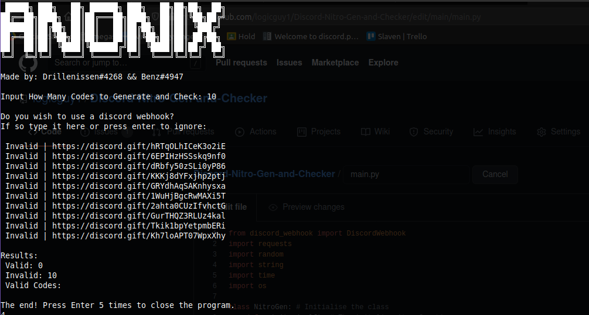

<p align="center">


</p>
<br />
<p align="center">
  <a href="https://github.com/othneildrew/Best-README-Template">
    
  </a>
  
  <h3 align="center">Discord Nitro Generator and Checker</h3>

  <p align="center">
    A discord nitro generator and checker for all your nitro needs
    <br />
    <a href="https://github.com/logicguy1/Discord-Nitro-Generator-and-Checker"><strong>Explore the docs »</strong></a>
    <br />
    <br />
    <a href="https://github.com/logicguy1/Discord-Nitro-Generator-and-Checker/issues">Report Bug</a>
    ·
    <a href="https://github.com/logicguy1/Discord-Nitro-Generator-and-Checker/issues">Request Feature</a>
      ·
    <a href="https://discord.gg/rchHUU9aGk">Join the discord</a>
  </p>
</p>
  
<details open="open">
  <summary>Table of Contents</summary>
  <ol>
    <li>
      <a href="#about-the-project">About The Project</a>
      <ul>
        <li><a href="#built-with">Built With</a></li>
      </ul>
    </li>
    <li>
      <a href="#getting-started">Getting Started</a>
      <ul>
        <li><a href="#prerequisites">Prerequisites</a></li>
        <li><a href="#installation">Installation</a></li>
      </ul>
    </li>
    <li><a href="#usage">Usage</a></li>
    <li><a href="#roadmap">Roadmap</a></li>
    <li><a href="#contributing">Contributing</a></li>
    <li><a href="#copyright">License</a></li>
    <li><a href="#contact">Contact</a></li>
  </ol>
</details>

## Proje hakkında.



Maksimum verimlilik için aynı anda  nitro kodları üretir ve kontrol eder

### Built With

* [Requests](https://github.com/psf/requests)
* [Discord webhook](https://github.com/lovvskillz/python-discord-webhook)
* [Colored](https://gitlab.com/dslackw/colored)

## Getting Started

Kopya almak için Sadece bunları izlemeniz yeterli

### Prerequisites
You need to install Python, that can be done [here](https://www.python.org)

### Installation
1. Clone the repo
   ```sh
   git clone https://github.com/logicguy1/Discord-Nitro-Generator-and-Checker.git
   ```
2. Install Python packages
   ```sh
   # Windows:
   py -3 -m pip install -r requirements.txt
   
   # Unix
   python3.8 -m pip install -r requirements.txt https://youtu.be/DuGt3Wj6T9M
   ```
   
#### Or this can be done using android with unrooted Termux
```
git clone https://github.com/logicguy1/Discord-Nitro-Generator-and-Checker
pkg install python
pip install -r requirements.txt
cd Discord-Nitro-Generator-and-Checker
python3 main.py
```
   
## Usage

'py -3 main.py' kullanarak 'main.py' dosyasını çalıştırın
Kod size iki istem gösterecektir:
1. Kaç kod üretilecek
2. Eğer bir discord webhook kullanmak istiyorsanız, nasıl bir discord webhook url'si alacağınızı bilmiyorsanız, şurada bulunur:
   ```kanal ayarları » entegrasyonlar » web_hook » web_hook oluştur```
   Bir web_hook kullanmak istemiyorsanız, bunu boş bırakmanız yeterlidir.

Bu adımdan sonra kod oluşturmaya ve kontrol etmeye başlayacaktır.
_For more examples, please refer to the [Documentation](https://example.com)_

## Roadmap

See the [open issues](https://github.com/logicguy1/Discord-Nitro-Generator-and-Checker/issues) for a list of proposed features (and known issues).

## Katkı

Katkılar, açık kaynak topluluğunu öğrenmek, ilham vermek ve yaratmak için harika bir yer yapan şeydir. Yaptığınız katkılar **çok takdir edilmektedir**
1. Projeyi Çatallayın
2. Özellik Dalınızı oluşturun (git checkout -b feature/AmazingFeature)
3. Değişikliklerinizi yapın (git commit -m 'Add some AmazingFeature')
4. Şubeye İtin (git push origin feature/AmazingFeature)
5. Bir Çekme Talebi Açın
## Licence

Telif hakkı © 2021 Drillenissen#4268

İşbu belgeyle, bu yazılımın ve ilgili belge dosyalarının ("Yazılım") bir kopyasını edinen herhangi bir kişiye, kullanım, kopyalama, değiştirme, birleştirme hakları dahilinde ancak bunlarla sınırlı olmamak üzere, herhangi bir kısıtlama olmaksızın Yazılımla ilgilenme izni verilir. Yazılımın kopyalarını yayınlamak, dağıtmak, alt lisansını vermek ve/veya satmak ve Yazılımın sağlandığı kişilerin aşağıdaki koşullara tabi olarak bunu yapmasına izin vermek:

Yukarıdaki telif hakkı bildirimi ve bu izin bildirimi, Yazılımın tüm kopyalarına veya önemli bölümlerine dahil edilecektir.

YAZILIM, SATILABİLİRLİK, BELİRLİ BİR AMACA UYGUNLUK VE İHLAL ETMEME GARANTİLERİ DAHİLİNDE ANCAK BUNLARLA SINIRLI OLMAMAK ÜZERE, AÇIK VEYA ZIMNİ HERHANGİ BİR GARANTİ OLMAKSIZIN “OLDUĞU GİBİ” SAĞLANIR. YAZARLAR VE TELİF HAKKI SAHİPLERİ HİÇBİR DURUMDA HERHANGİ BİR DAVA, HAKSIZ FİİL YA DA  SÖZLEŞME V.B, BİR EYLEM, ZARAR VEYA DİĞER SORUMLULUKLARDAN , YAZILIMI KULLANAN SORUMLU OLACAKTIR.

## Contact

Logicguy - [@Drillenissen#4268](https://www.discordapp.com) - logicguy.mailandcontact@gmail.com

Project Link: [https://github.com/logicguy1/Discord-Nitro-Generator-and-Checker](https://github.com/logicguy1/Discord-Nitro-Generator-and-Checker)

<!-- Statistics -->  

<p>

</p>
